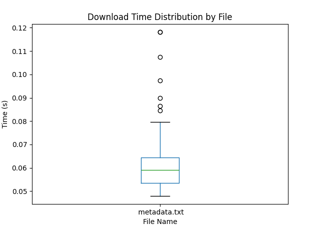
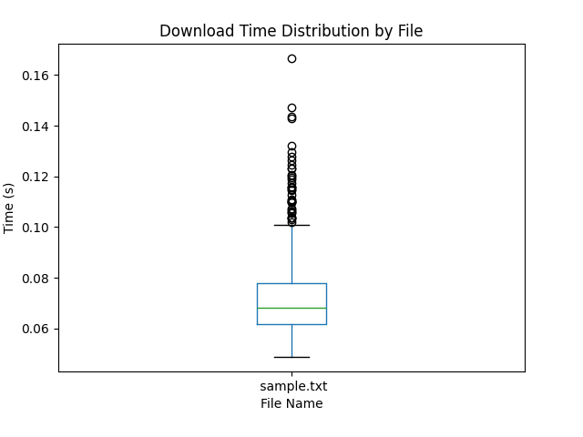
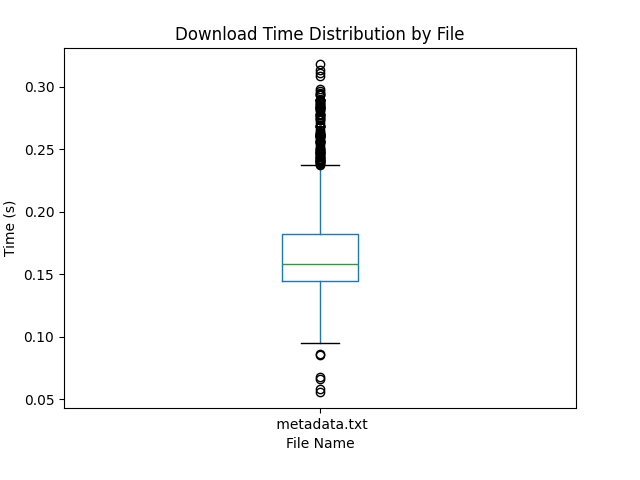
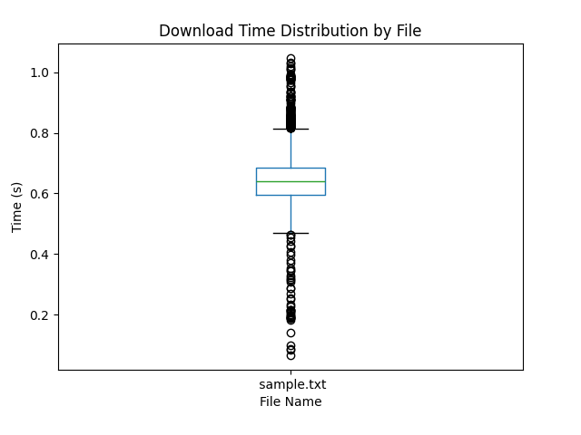
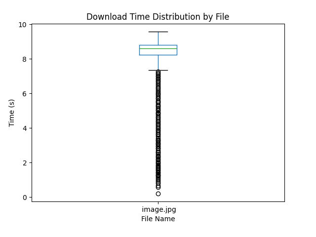

# PART 2: **Analysis Report**

### **Experimental Setup**
- **Chosen Experiment Option:**  **Option B**
  - Measuring the time taken to download a fixed number of files (x number of times) as the number of clients increases.
  - Files are overwritten locally to simulate realistic conditions.
  - Option B was tested for various types of files, including .jpg and .txt files, to ensure compatibility and performance across different file formats.
  - Each client downloaded a file 100 times during testing to evaluate server performance under load.

- **Test Environment:**
  - **Server**: Hosted on a separate machine.
  - **Clients**: Multiple simulated clients using a bash script
  - **Network Conditions**: Standard local network with consistent bandwidth.
  - **Trials**: Each test was repeated three times for statistical accuracy.
  - **Metrics Measured**:
    - Download completion time.
    - Performance degradation with an increasing number of clients using box plots

---
### How to run the tests
- Navigate to the performance directory
- run the following commands in order:

    ```
      python serverpart2.py
    ```
---
- change the hostname to name of the machine the server is running on, in the bash script
- Set the amount of amount of clients u want to run
- Set the file downloads per client
- run the script  
      
    ```
      bash test.sh
    ```

- plot the boxplots using
      
    ```
      python plot.py
    ```
    


### **Download Time Distribution for 5 Clients**


### **Download Time for 10 Clients**


### **Download Time for 20 Clients**


### **Download Time for 50 Clients**


### **Download Time for 100 Clients**


---

## **Findings & Observations**
### How Did Increasing the Number of Clients Impact Server Performance?

- As the number of clients increased, download times generally increased.

- Performance was stable for lower client counts (5-10 clients), but once the number of clients increased beyond 20 clients, delays started to compound.

- At 50+ clients, variance increased significantly, indicating inconsistent response times.

- At 100 clients, the performance degraded severely, with some download times reaching as high as 10 seconds.
---

### Did Performance Degrade Linearly, Quadratically, or Otherwise? Why?

- Performance degradation was exponential, not linear.

- For 5-10 clients, the impact was minor, but beyond 20 clients, the download times increased at a much higher rate.

- The higher the load, the more erratic the response times became, indicating a bottleneck in server resource handling.

- This behavior suggests that server congestion, limited concurrent connections, and resource exhaustion contributed to an exponential slowdown at high loads.

---


### Potential Optimizations to Improve Performance

To improve performance, several optimizations could be considered:

#### Multi-threading or Asynchronous Handling

- The current system is handling requests sequentially. Since the purpose of the assignment is to test the use select statements and sockets, the idea of sequential handling of requests is ideal.

- Switching to a multi-threaded could significantly improve efficiency.

#### Optimized File Transfer Mechanism

- Using more efficient file transfer protocols (e.g., HTTP or WebSockets) could improve throughput.

- Implementing caching mechanisms for frequently requested files can reduce redundant file transfers.

#### Server Resource Scaling

- Using a cloud enviornment to dynamically allocate resources could be helpful

- Distributing requests across multiple servers could reduce the load on a single instance.

#### Rate Limiting and Queueing

- Implementing rate limiting to prevent excessive simultaneous requests from overwhelming the server.

- Introducing a queueing mechanism to process requests in a controlled manner, ensuring fair distribution of resources.


## Outliers Analysis Summary
Outliers in the boxplots represent instances where file download times were significantly higher than the typical values, indicating periods of server congestion, network latency, or processing delays. As the number of concurrent clients increased, the frequency and severity of outliers grew, suggesting that the server struggled to manage high loads effectively. At lower client counts (5-10 clients), outliers were rare and had minimal impact on performance, indicating stable request handling.

At 20 clients, a noticeable increase in outliers appeared, with download times occasionally spiking. This suggests that some requests were delayed due to concurrent processing limits.
At 50 clients, the spread of download times widened significantly, with multiple outliers exceeding normal expectations. This reflects queuing delays and uneven request handling.
At 100 clients, extreme outliers emerged, with some download times reaching up to 10 seconds, demonstrating that the server was severely overloaded and struggled to process requests efficiently.

These outliers highlight the server's inability to scale linearly with increasing load, leading to erratic performance under high concurrency. To mitigate this, optimizations such as load balancing, caching, asynchronous request handling, and rate limiting should be implemented to reduce extreme delays and ensure stable performance even under heavy client loads.

----
